# Portofolio Ralf van Aert
**TI1.3 FP Individueel Resultaat**
> TI1.3 IPR Ralf van Aert\
Studentennummer: 2163995\
E-mail: <rpj.vanaert@student.avans.nl>


#### Delete this, to-do list:
- Wekelijkse reflectie van eigen bijdrage
    - Les week 2 t/m 9
- Wekelijkse vakinhoudelijke reflectie
    - Minstens 4 waarvan 1 voor ontwerpfase
- Reflectie op stellingen
    - Minstens 1 reflectie op onderzoeksmethodiek
        - Hoe je te werk bent gegaan. Inclusief conclusie en bronvermeldingen
- Lijst met applicatie die gebruik maken van JSON
#### Delete this, to do list: ^


## Inhoudsopgave
<div id="TOC">
<ul>
    <li>
    <h3>
        <a href="#intro"> Inleiding </a>
    </h3>
    </li>
    <li>
    <h3>
        <a href="#weekly"> Weekelijkse Reflectie</a>
    </h3>
    </li>
        <ul>
            <li>
                <a href="#week2">Week 2</a>  
            </li>
            <li>
                <a href="#week3">Week 3</a>  
            </li>
            <li>
                <a href="#week4">Week 4</a>  
            </li>
            <li>
                <a href="#week5">Week 5</a>  
            </li>
            <li>
                <a href="#week6">Week 6</a>  
            </li>
            <li>
                <a href="#week7">Week 7</a>  
            </li>
            <li>
                <a href="#week8">Week 8</a>  
            </li>
            <li>
                <a href="#week9">Week 9</a>  
            </li>
        </ul>
    <li>
    <h3>
        <a href="#onderzoeksMethodiek"> Reflectie Onderzoeksmethodiek </a>
    </h3>
    </li>
</ul>
</div>

---

<div id="intro">
    <h2>
        <a href="TOC"> Inleiding</a>
    </h2>
<div>

<div id="weekly">
    <h2>
        <a href="TOC">Wekelijkse Reflectie</a>
    </h2>
</div>
Inleiding weekelijkse reflectie

<div id="week2">
    <h2>
        <a href="TOC">Week 2</a>
    </h2>
</div>

#### **Reflectie eigen bijdrage**
Bij het verdelen van de rollen is codebeheerder aan mij gegeven, dit is vooral omdat ik nog niet goed met GIT/GIT-Kraken om kan gaan. Op deze manier en met de hulp van mijn groepsleden, hoop ik GIT te leren begrijpen.

Ook hebben we een Plan van Aanpak gemaakt, daarbij heb ik het achtergrond gemaakt en gegevens/opmaak mede-geregeld. Naast dat heb ik ook de Java-Style-Guide opgezet en samen met de rest overlegd over het samenwerkings contract.

Tot slot heb ik de repository opgezet bij GIT-hub, met wat hulp van andere. Ik heb veel problemen gehad met GIT op het begin, maar alles is uiteindelijk verholpen. Ik heb aan de Visual-tab als paar, waarbij ik meedacht. Visual-tab is niet volledig modulair, maar simpel en elegant genoeg om de benodigde variabele snel aan te passen. De visual-tab modulairder te maken is dus ook een toekomstige verbetering die eventueel zou kunnen gebeuren.

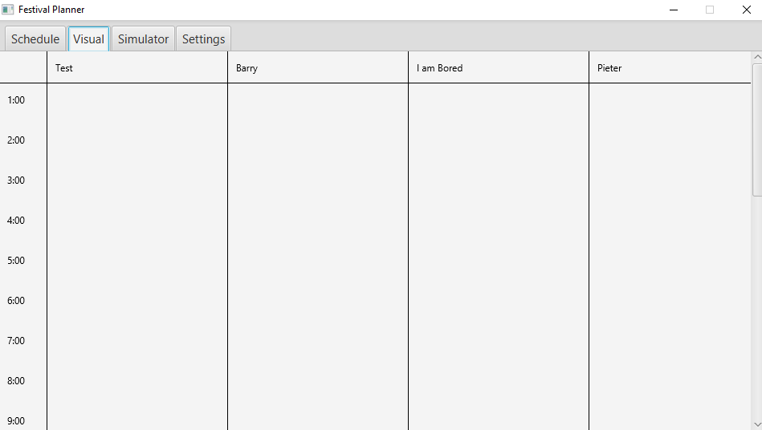

#### **Reflectie technische & vakinhoudelijke bijdrage**
Er zijn in de tweede week veel kleine, maar grondige besluiten genomen. Hiervan ga ik er een paar beschrijven waaraan ik heb mee gedacht met beredenering.

We waren al van plan elke artiest en show een genre te geven, maar we hadden niks gedetaileerd afgesproken. We hadden al besloten om redelijk veel genres te nemen als enumerator. Nu moesten alleen nog bepalen of we hiervan een apart java bestand van maken. Daar hebben we voor gekozen, omdat deze enumerator door verschillende klasses gebruikt gaat worden. Ook zorgt dit voor meer duidelijkheid in de code.

---

<div id="week3">
    <h2>
        <a href="TOC">Week 3</a>
    </h2>
</div>

### **Reflectie eigen bijdrage**
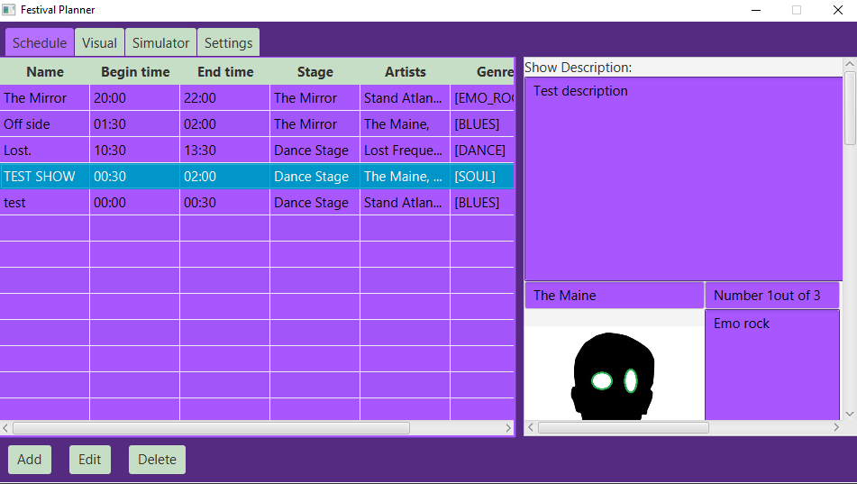
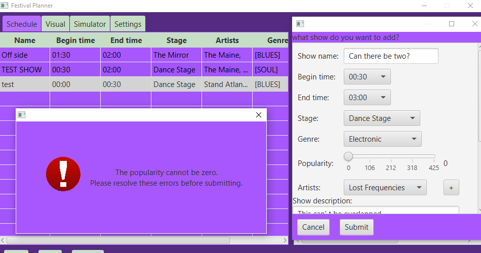
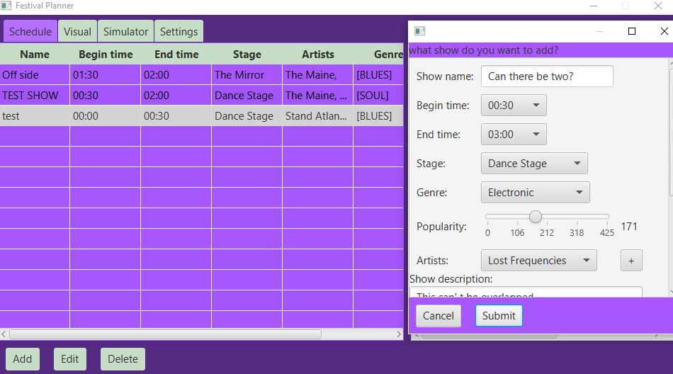

Deze week heb ik aan het begin veel meegedacht aan de problemen van schedule tab,
maar naast dat veel testen en kleine features verfijnen en maken. Ik heb ook gewerkt aan de artiesten afbeelding keuze optie, maar dit is niet door gegaan.
Dit kwam doordat, beide javax.json en google.gson de afbeeldingen niet wilde opslaan.

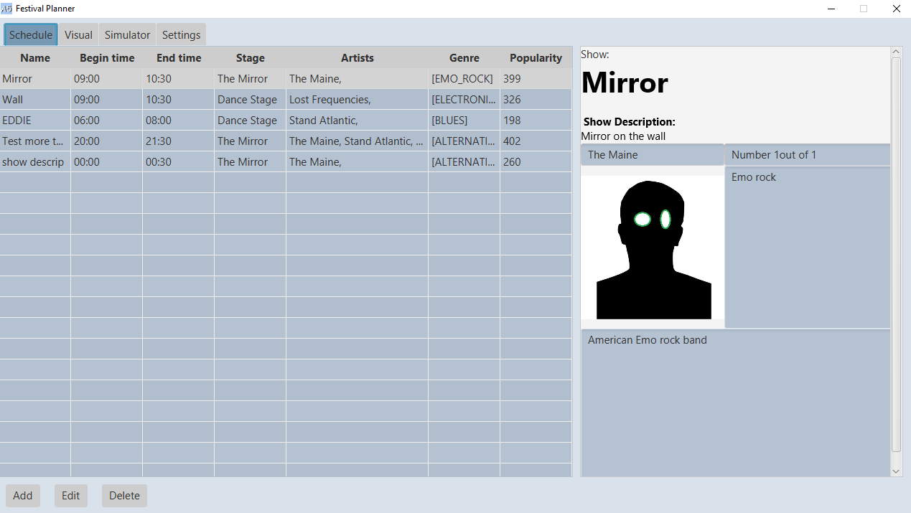

Naast dat heb ik de (mijn mening vreselijke) paarse kleurpallet aangepast naar lichtblauw en grijs, dit ziet er veel rustiger uit. Ook heb ik de window groter gemaakt met de daar nodige aanpassingen aan schedule tab en visual tab. De show en artiesten beschrijving weergave (die weergeeft de geselecteerde show met bijhorende artiest(en)) was het mogelijk om horizontaal te scrollen, dit is eruit gehaald inclusief andere verhoudingen tussen de TextArea's.

Ik heb de show beschrijving van een TextArea omgezet naar een TextFlow. De bijhorende code;

 ```java     
    VBox descriptionBase = new VBox();
    descriptionBase.getChildren().add(new Label("Show:"));
    TextFlow showDescriptionTextFlow = new TextFlow();

    Text textTitle = new Text(this.selectedItem.getName());
    textTitle.setStyle("-fx-font-weight: bold; -fx-font-size: 40");

    Text textDescrTitle = new Text("\n\n Show Description:");
    textDescrTitle.setStyle("-fx-font-weight: bold;");

    Text textDescription = new Text("\n" + this.selectedItem.getDescription());
    showDescriptionTextFlow.getChildren().addAll(textTitle, textDescrTitle, textDescription);
    showDescriptionTextFlow.setMaxWidth(450);
```


Zoals je in de code kan zien, stop ik Text een TextFlow object. De Text klasse geeft de mogelijkheid om de text **dik-gedrukt** te krijgen. Ook is de TextFlow de maximale breedte meegegeven, hier zonder variabele nog, als magicnumber.

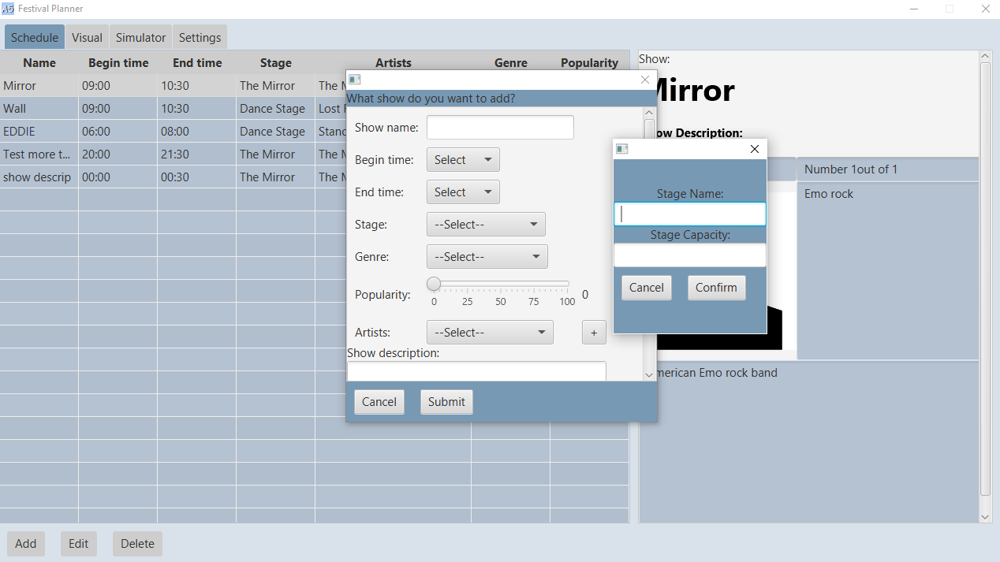

In de afbeelding hierboven is weer te zien hoe de kleuren zijn geworden. Voor de rest zijn er kleine aanpassingen gedaan, zoals de window bij het toevoegen en aanpassen van shows was nog resizable, wat dus niet meer is.

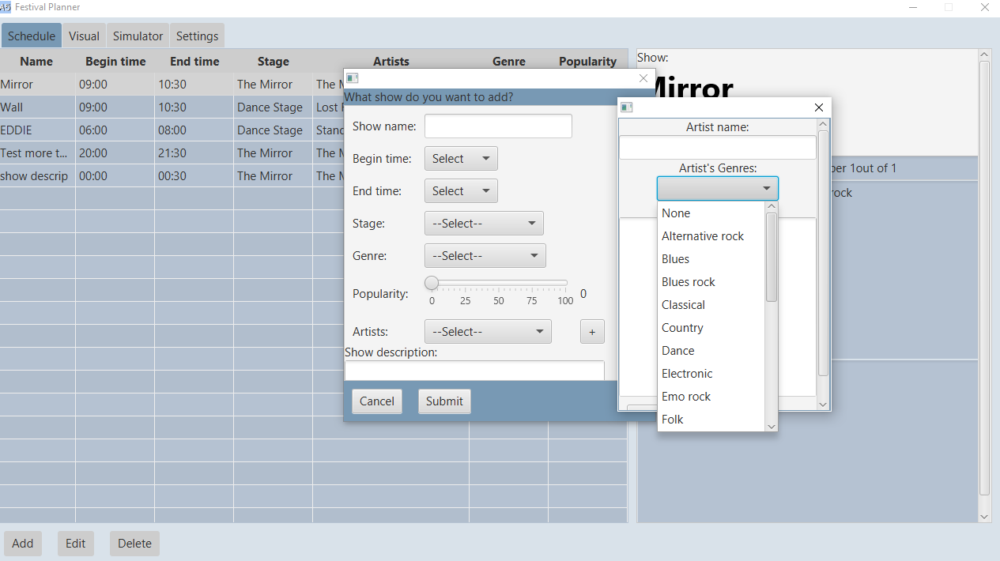
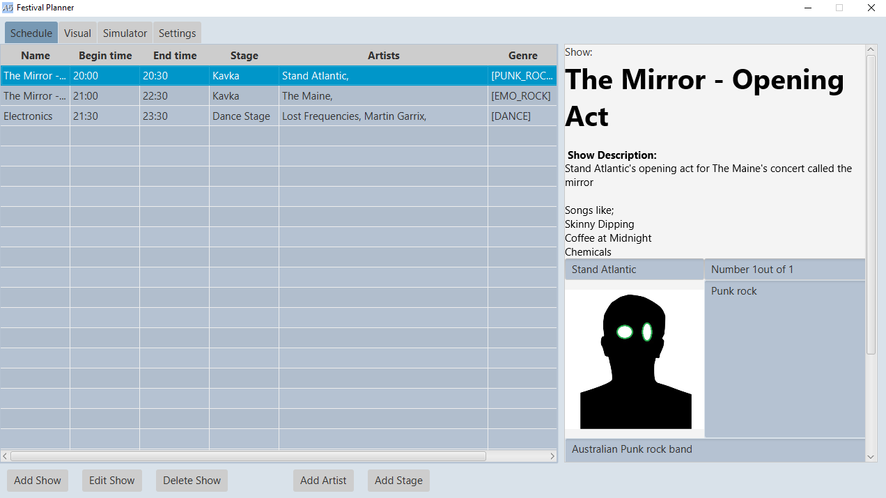

De laatste afbeelding van de schedule tab is de uiteindelijke geworden voor de demo bij de senior. ten slot de weergave van visual-tab hieronder, een canvas in een scrollpane, hier heb ik zelf niet aan gewerkt, maar wel aangepast bij het groter maken van de applicatie window.

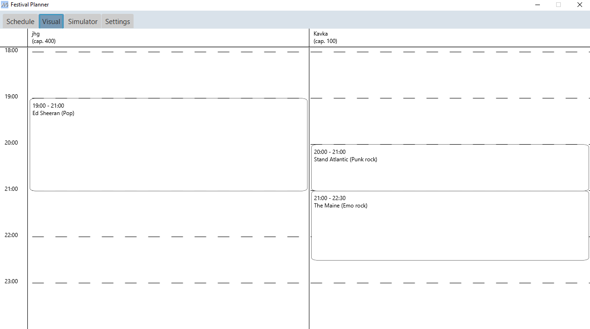

### **Reflectie technische & vakinhoudelijke bijdrage**


Bij een artiest wilde we een afbeelding gebonden, dit werkte niet. We kwamen er niet uit waarom gson/json het niet wilde. Dus hadden we een andere optie; filePath opslaan als string, ik heb dit ontwikkeld, werkend. Alleen deed ook nu helaas de gson/json niet (ook hier stack overflow error). Deze error verwees alleen naar de gson library en niet naar een lijn in de code. Johan Talboom heeft hier ook naar gekeken en kwam er ook niet uit.

Hierbij lees je de directory van de map in Resources folder uit, een aparte folder genaamd 'Artist_Images'. De files die eindigen op '.jpg', '.jpeg' of '.png' worden weergegeven als optie in een ComboBox en de geselecteerde optie wordt weergegeven. Ook is er de optie 'None' die de default artiesten afbeelding weergeeft als standaard optie in de ComboBox.

Omdat dit uiteindelijk niet werkte hebben we uiteindelijk besloten om dit als aparte branch te behouden en te werken aan de bugs en ontbrekende features van de agenda module in andere feature branches.

---

<div id="week4">
    <h2>
        <a href="TOC">Week 4</a>
    </h2>
</div>

### **Reflectie eigen bijdrage**
Deze week hebben we verder gewerkt aan het Plan van Aanpak, dit is geen onderdeel van het project, maar hier hebben we wel aangewerkt als project groep.

Naast dat moest er een map ingeladen worden deze week. We hebben een voorbeeld map gemaakt met behulp van Tiled. Daarmee hebben we een map gemaakt, deze map kan door Tiled opgeslagen worden als JSON file. Zie hiervoor technische & vakinhoudelijke bijdrage. De map wordt ingeladen per laag dit hoeft alleen bij initialisatie.

### **Reflectie technische & vakinhoudelijke bijdrage**
Hieronder is aangegeven in code hoe de eerste poging to map uitlezen ging. Uiteindelijk zijn anderen van mijn project groep hiermee verder gegaan. Die kregen een andere structuur in hun json file, maar het gebeurt met hetzelfde idee.
Deze code is modulair voor verschillende TileMaps, als deze maar hetzelfde structuur hebben.

Bij de constructor van Map, wordt eerst het JSON bestand uitgelezen naar hoogte en breedte, waarne de map, integer matrix, wordt opgesteld met de bijbehorende index voor elke subimage.

Nadat de TileSet waarvan gebruik is gemaakt in de JSON bestand gelezen, en deze op de juiste volgorde in een ArrayList met opslag type BufferedImage gestopt. De tile hoogte en breedte worden hier uitgelezen van het JSON bestand, ook hier weer modulair in verhouding met de TileMap.
```java
public Map(String fileName) {
        JsonReader reader = null;
        reader = Json.createReader(getClass().getResourceAsStream(fileName));
        JsonObject root = reader.readObject();

        this.width = root.getJsonArray("layers").getJsonObject(0).getInt("width");
        this.height = root.getJsonArray("layers").getJsonObject(0).getInt("height");

        this.map = new int[this.height][this.width];
        for (int y = 0; y < this.height; y++) {

            for (int x = 0; x < this.width; x++) {

                int i = x + y * 32;
                int adding = root.getJsonArray("layers").getJsonObject(0).getJsonArray("data").getInt(i);
                this.map[y][x] = adding;
            }
        }

        try {
            BufferedImage tilemap = ImageIO.read(getClass().getResourceAsStream(root.getJsonArray("tilesets").getJsonObject(0).getString("image")));

            this.tileHeight = root.getJsonArray("tilesets").getJsonObject(0).getInt("tileheight");
            this.tileWidth = root.getJsonArray("tilesets").getJsonObject(0).getInt("tilewidth");

            for (int y = 0; y < tilemap.getHeight(); y += this.tileHeight) {

                for (int x = 0; x < tilemap.getWidth(); x += this.tileWidth) {
                    this.tiles.add(tilemap.getSubimage(x, y, this.tileWidth, this.tileHeight));
                }
            }
        } catch (IOException e) {
            e.printStackTrace();
        }
    }
```
Als de map getekend moet worden, wordt de volgende draw functie opgeroepen. De draw methode gaat door de integer matrix map met 2 for-loops en tekent de bijbehorende subimage voor de tile op de juiste plek.

```java
public void draw(Graphics2D g2d) {

        for (int y = 0; y < height; y++) {
            for (int x = 0; x < width; x++) {
                if (map[y][x] < 0)
                    continue;
                
                g2d.drawImage(
                        this.tiles.get(map[y][x] - 1),
                        AffineTransform.getTranslateInstance(x*tileWidth, y*tileHeight),
                        null);
            }
        }


    }
```
---

<div id="week5">
    <h2>
        <a href="TOC">Week 5</a>
    </h2>
</div>

### **Reflectie eigen bijdrage**

- TestCaseDiagram en testen Schedule tab

### **Reflectie technische & vakinhoudelijke bijdrage**

- Constraints over Stages, de hoeveelheid op de map en capacity

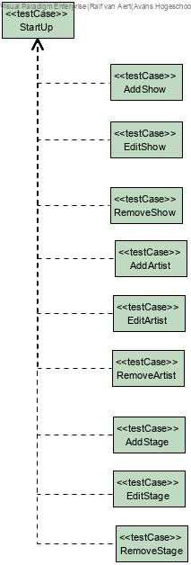

j

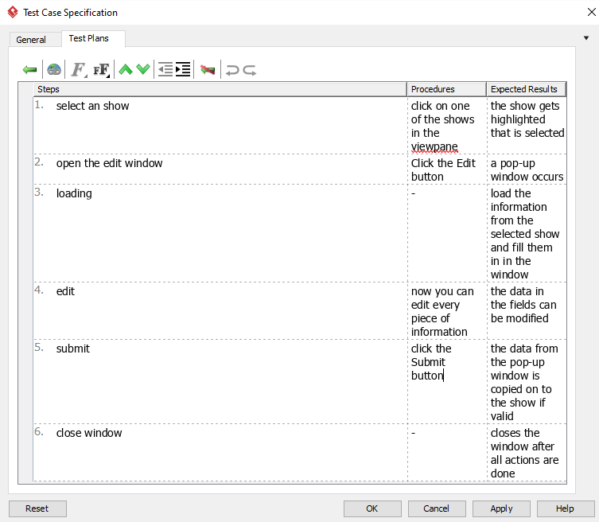

j

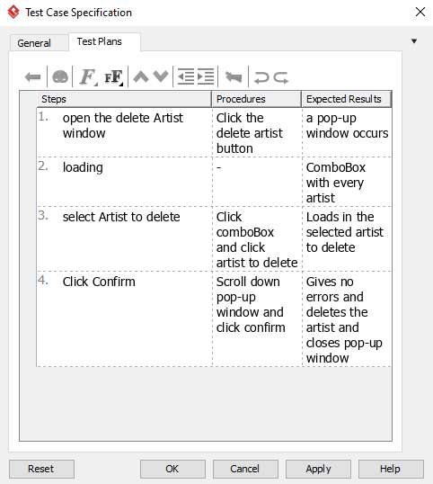

j

---

<div id="week6">
    <h2>
        <a href="TOC">Week 6</a>
    </h2>
</div>
### **Reflectie eigen bijdrage**

- CameraTransform

### **Reflectie technische & vakinhoudelijke bijdrage**
Deze week heb ik aan het CameraTransform gewerkt, dit is gemaakt door de Canvas Node mee te geven in de constructor. Vervolgens worden er de nodige setOnAction events gezet met de handling die nodig is.

Bij elke muisklik wordt de lastMousePos daarop gezet. Het slepen wordt gedaan met de scroll knop, de middelste muisknop. De nieuwe originReplacePos, de verplaatsing vanaf het oorspronkelijke nulpunt, is de oude originReplacePos + het verschil tussen de lastMousePos en de event positie.

Dat was voor het slepen, naast dat wordt om het scrollen in verhouding met fysieke scroll goed te krijgen de detlaY van de scroll omgerekend naar zoom.
```java
 public CameraTransform(Canvas node){
        //Default zoom and originReplacePos; no zoom and originReplacePos default to origin.
        this.zoom = 1.0;
        this.originReplacePos = new Point2D.Double(0,0);

        //Sets zoom on scroll to according zoom value in correlation with deltaY.
        node.setOnScroll(event -> {
            zoom *= (1 + event.getDeltaY()/150.0f);
        });

        //Replaces originReplacePos on mouse dragging with the middle mouse button(scroll button press-in)
        //New originReplacePos is the old replace position with the difference of the lastMousePos and the current mouse positions
        //Zoom is calculated in it with the mouse positions
        node.setOnMouseDragged(event -> {
            if (event.getButton() == MouseButton.MIDDLE){
                originReplacePos = new Point2D.Double(
                        originReplacePos.getX() + (event.getX() - lastMousePos.getX()) / zoom,
                        originReplacePos.getY() + ( event.getY() - lastMousePos.getY()) / zoom
                );
            }
            lastMousePos = new Point2D.Double(event.getX(), event.getY());
        });

        //Sets lastMousePos on any mouse button pressed
        node.setOnMousePressed(event -> lastMousePos = new Point2D.Double(event.getX(), event.getY()));
        this.canvas = node;
    }
```
Bij elke draw wordt de CameraTransform gevraagd voor de Transform van de FXGraphics2D. Deze is afhankelijk van de veranderde originReplacePos en zoom bij de setOnAction events. De inverseTransform wordt opgeslagen als attribuut voor de vertaling van scherm naar canvas.

Dat wordt gedaan bij getRelPoint2D, deze methode wordt gebruikt in de simulator klasse om de plaats van de muis te bepalen t.o.v. de translaties en scaling die gedaan is.


```java
 AffineTransform inverseTransform;

    /***
     * getTransform
     *
     * Calculates the CameraTransform with the zoom en replaceOriginPos that has been tracked.
     * Also saves inverse transformation in inverseTransform.
     *
     * @return AffineTransform: CameraTransform
     */
    public AffineTransform getTransform(){
        if (originReplacePos != null){
            AffineTransform tx = new AffineTransform();
            tx.scale(zoom, zoom);
            tx.translate(originReplacePos.getX(), originReplacePos.getY());
            try {
                this.inverseTransform = tx.createInverse();
            } catch (NoninvertibleTransformException e) {
                e.printStackTrace();
            }
            return tx;
        } else {
            return new AffineTransform();
        }
    }

    /***
     * getRelPoint2D
     *
     * returns the relative Point2D object that is correct with the camera transformation that has been done,
     * for the x and y given in the parameters.
     *
     * @param x
     * @param y
     * @return Point2D
     */
    public Point2D getRelPoint2D(double x, double y){
        Point2D.Double relP2D = new Point2D.Double(x * inverseTransform.getScaleX() + inverseTransform.getTranslateX(), y * inverseTransform.getScaleY() + inverseTransform.getTranslateY());
        return relP2D;
    }
```
  In de draw methode van de simulator klasse, wordt de originReplacePos opgevraagt om de clearRect te bepalen. Ook wordt de Zoom daarvoor gevraagd, wat de juiste schaling geeft.

  Voor de rest is er voor test redenen een optie om met de rechter muisknop te togglen tussen CameraTransform en geen CameraTransform. De transform wordt gewoon door middel van een getter opgevraagd zoals bij vorige blok code gegeven.
```java
/***
     * draw
     *
     * clearRect and sets background.
     * Applies the according transformation
     * Handles persons
     *
     * @param g2
     */
    public void draw(FXGraphics2D g2) {
        //Gets right originReplacePos and zoom, applies the originReplacePos and zoom(scaling) to get right clearRect
        Point2D p2d = this.cameraTransform.getOriginReplacePos();
        double zoom = cameraTransform.getZoom();
        g2.clearRect(-(int)p2d.getX(), -(int)p2d.getY(), (int) (canvas.getWidth() / zoom), (int) (canvas.getHeight() / zoom));

        //Depending on show mode, shows does or doesn't show cameraTransform
        if (!this.showNull){
            g2.setTransform(this.cameraTransform.getTransform());
        } else {
            g2.setTransform(new AffineTransform());
        }
        //White background and black rectangle for clarity
        g2.setBackground(Color.WHITE);
        Shape rect = new Rectangle2D.Double(0, 0, 2500, 2500);
        g2.setPaint(Color.BLACK);
        g2.draw(rect);

        //Draws every person
        for (Person person : people) {
            person.draw(g2);
        }
    }
```

---

<div id="week7">
    <h2>
        <a href="TOC">Week 7</a>
    </h2>
</div>

- CameraTransform insight
- TileMap saving as BufferedImage.

### **Reflectie eigen bijdrage**


### **Reflectie technische & vakinhoudelijke bijdrage**

---

<div id="week8">
    <h2>
        <a href="TOC">Week 8</a>
    </h2>
</div>

### **Reflectie eigen bijdrage**


### **Reflectie technische & vakinhoudelijke bijdrage**

---

<div id="week9">
    <h2>
        <a href="TOC">Week 9</a>
    </h2>
</div>

### **Reflectie eigen bijdrage**


### **Reflectie technische & vakinhoudelijke bijdrage**


---

<div id="onderzoeksMethodiek">
    <h2>
        <a href="TOC">Reflectie Onderzoeksmethodiek</a>
    </h2>
</div>