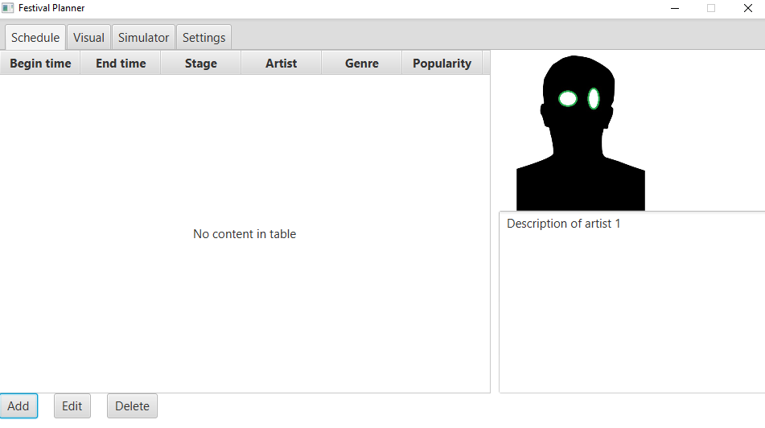

# Portofolio Ralf van Aert
TI1.3 IPR Ralf van Aert

- Wekelijkse reflectie van eigen bijdrage
    - Les week 2 t/m 9
- Wekelijkse vakinhoudelijke reflectie
    - Minstens 4 waarvan 1 voor ontwerpfase
- Reflectie op stellingen
    - Minstens 1 reflectie op onderzoeksmethodiek
        - Hoe je te werk bent gegaan. Inclusief conclusie en bronvermeldingen
- Lijst met applicatie die gebruik maken van JSON
## Inhoudsopgave

<h3>
        <a href="#weekly"> Weekelijkse Reflectie</a>
    <ul>
        <li>
            <a href="#week2">Week 2</a>  
        </li>
        <li>
            <a href="#week3">Week 3</a>  
        </li>
        <li>
            <a href="#week4">Week 4</a>  
        </li>
        <li>
            <a href="#week5">Week 5</a>  
        </li>
        <li>
            <a href="#week6">Week 6</a>  
        </li>
        <li>
            <a href="#week7">Week 7</a>  
        </li>
        <li>
            <a href="#week8">Week 8</a>  
        </li>
        <li>
            <a href="#week9">Week 9</a>  
        </li>
    </ul>

    <h2>
        <a href="TOC">Wekelijkse Reflectie</a>
    </h2>

Inleiding weekelijkse reflectie

    <h2>
        <a href="TOC">Week 2</a>
    </h2>

#### Reflectie eigen bijdrage

#### Reflectie technische & vakinhoudelijke bijdrage
Er zijn in de tweede week veel kleine, maar grondige besluiten genomen. Hiervan ga ik er een paar beschrijven waaraan ik heb mee gedacht met beredenering.

We waren al van plan elke artiest en show een genre te geven, maar we hadden niks gedetaileerd afgesproken. We hadden al besloten om redelijk veel genres te nemen als enumerator. Nu moesten alleen nog bepalen of we hiervan een apart java bestand van maken. Daar hebben we voor gekozen, omdat deze enumerator door verschillende klasses gebruikt gaat worden. Ook zorgt dit voor meer duidelijkheid in de code.

    <h2>
        <a href="TOC">Week 3</a>
    </h2>

    <h2>
        <a href="TOC">Week 4</a>
    </h2>

    <h2>
        <a href="TOC">Week 5</a>
    </h2>

    <h2>
        <a href="TOC">Week 6</a>
    </h2>

    <h2>
        <a href="TOC">Week 7</a>
    </h2>

    <h2>
        <a href="TOC">Week 8</a>
    </h2>

    <h2>
        <a href="TOC">Week 9</a>
    </h2>

## Reflectie Onderzoeksmethodiek